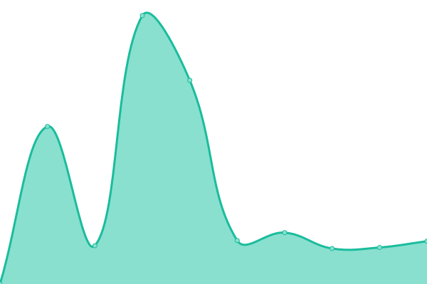
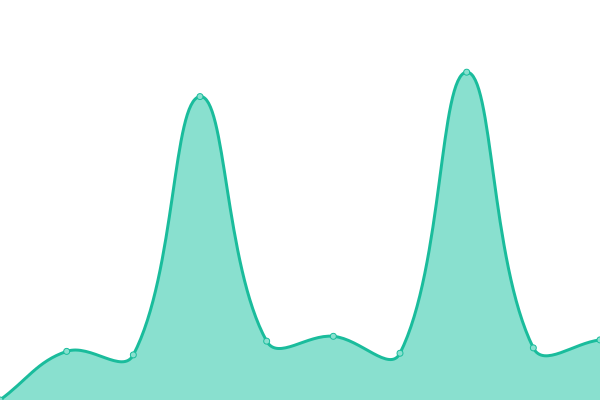
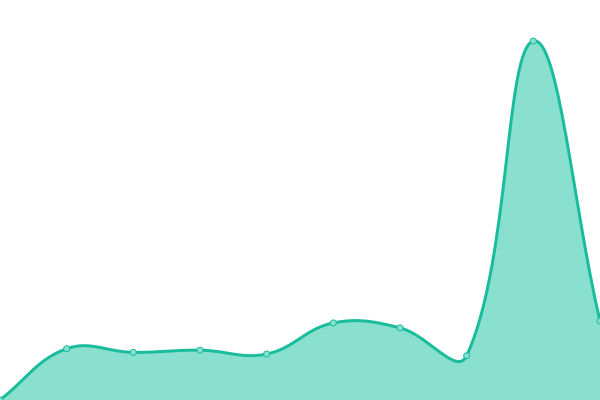

# [📈 Live Status](https://up.gastroklick.de): <!--live status--> **🟧 Partial outage**

This repository contains the open-source uptime monitor and status page for [koko-io](https://up.gastroklick.de), powered by [Upptime](https://github.com/upptime/upptime).

With [Upptime](https://upptime.js.org), you can get your own unlimited and free uptime monitor and status page, powered entirely by a GitHub repository. We use [Issues](https://github.com/koko-io/up/issues) as incident reports, [Actions](https://github.com/koko-io/up/actions) as uptime monitors, and [Pages](https://up.gastroklick.de) for the status page.

<!--start: status pages-->
<!-- This summary is generated by Upptime (https://github.com/upptime/upptime) -->
<!-- Do not edit this manually, your changes will be overwritten -->
<!-- prettier-ignore -->
| URL | Status | History | Response Time | Uptime |
| --- | ------ | ------- | ------------- | ------ |
|  [Leo Pizza](https://leo-pizza.de) | 🟥 Down | [leo-pizza.yml](https://github.com/koko-io/up/commits/HEAD/history/leo-pizza.yml) | 

 959ms
     
 | 

<a href="https://up.gastroklick.de/history/leo-pizza">82.80%</a>
    

|  [Leo Pizza](https://leo-pizzaservice.de) | 🟥 Down | [leo-pizza.yml](https://github.com/koko-io/up/commits/HEAD/history/leo-pizza.yml) | 

 959ms
     
 | 

<a href="https://up.gastroklick.de/history/leo-pizza">82.80%</a>
    

|  [Leo Bollywood](https://leo-bollywood.de) | 🟩 Up | [leo-bollywood.yml](https://github.com/koko-io/up/commits/HEAD/history/leo-bollywood.yml) | 

 3701ms
     
 | 

<a href="https://up.gastroklick.de/history/leo-bollywood">100.00%</a>
    

|  [Leo China](https://leo-chinaservice.de) | 🟩 Up | [leo-china.yml](https://github.com/koko-io/up/commits/HEAD/history/leo-china.yml) | 

 7422ms
     
 | 

<a href="https://up.gastroklick.de/history/leo-china">100.00%</a>
    

|  [Pizzeria Atlantic](https://pizza-atlantic.de) | 🟩 Up | [pizzeria-atlantic.yml](https://github.com/koko-io/up/commits/HEAD/history/pizzeria-atlantic.yml) | 

 2806ms
     
 | 

<a href="https://up.gastroklick.de/history/pizzeria-atlantic">100.00%</a>
    

|  [Pizza Blitz Waldenbuch](https://pizza-waldenbuch.de) | 🟩 Up | [pizza-blitz-waldenbuch.yml](https://github.com/koko-io/up/commits/HEAD/history/pizza-blitz-waldenbuch.yml) | 

 1611ms
     
 | 

<a href="https://up.gastroklick.de/history/pizza-blitz-waldenbuch">100.00%</a>
    

|  [Pizza-Express Palermo](https://pizzaservice-palermo.de) | 🟩 Up | [pizza-express-palermo.yml](https://github.com/koko-io/up/commits/HEAD/history/pizza-express-palermo.yml) | 

 1393ms
     
 | 

<a href="https://up.gastroklick.de/history/pizza-express-palermo">100.00%</a>
    

|  [Largo Gebäubereinigung](https://largo-reinigung.de) | 🟩 Up | [largo-gebaeubereinigung.yml](https://github.com/koko-io/up/commits/HEAD/history/largo-gebaeubereinigung.yml) | 

 1189ms
     
 | 

<a href="https://up.gastroklick.de/history/largo-gebaeubereinigung">100.00%</a>
    

|  [GastroKlick Newsletter](https://newsletter.gastroklick.de) | 🟩 Up | [gastro-klick-newsletter.yml](https://github.com/koko-io/up/commits/HEAD/history/gastro-klick-newsletter.yml) | 

 569ms
     
 | 

<a href="https://up.gastroklick.de/history/gastro-klick-newsletter">100.00%</a>
    

|  [Google](https://www.google.com) | 🟩 Up | [google.yml](https://github.com/koko-io/up/commits/HEAD/history/google.yml) | 

 99ms
     
 | 

<a href="https://up.gastroklick.de/history/google">100.00%</a>
    

|  [IPv6 test](forwardemail.net) | 🟥 Down | [i-pv6-test.yml](https://github.com/koko-io/up/commits/HEAD/history/i-pv6-test.yml) | 

 0ms
     
 | 

<a href="https://up.gastroklick.de/history/i-pv6-test">100.00%</a>
    

<!--end: status pages-->

[**Visit our status website →**](https://up.gastroklick.de)

## 📄 License

- Powered by: [Upptime](https://github.com/upptime/upptime)
- Code: [MIT](./LICENSE) © [Anand Chowdhary](https://anandchowdhary.com), supported by [Pabio](https://pabio.com)
- Data in the `./history` directory: [Open Database License](https://opendatacommons.org/licenses/odbl/1-0/)
